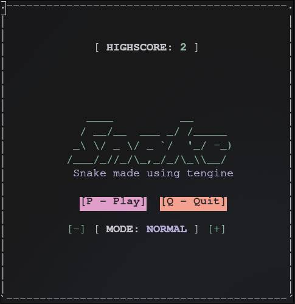
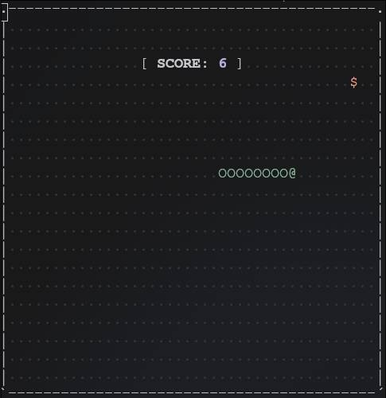
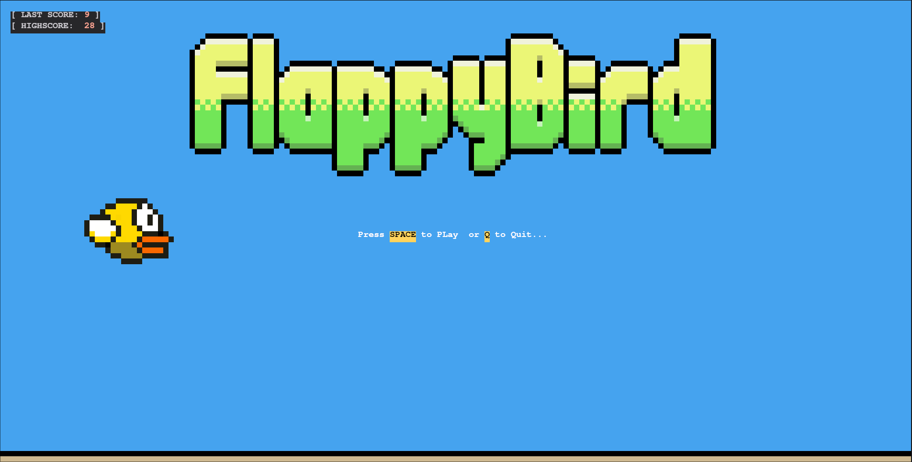
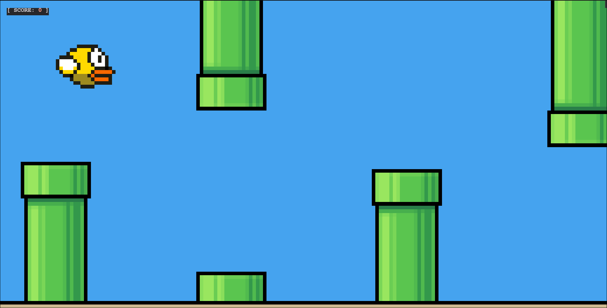
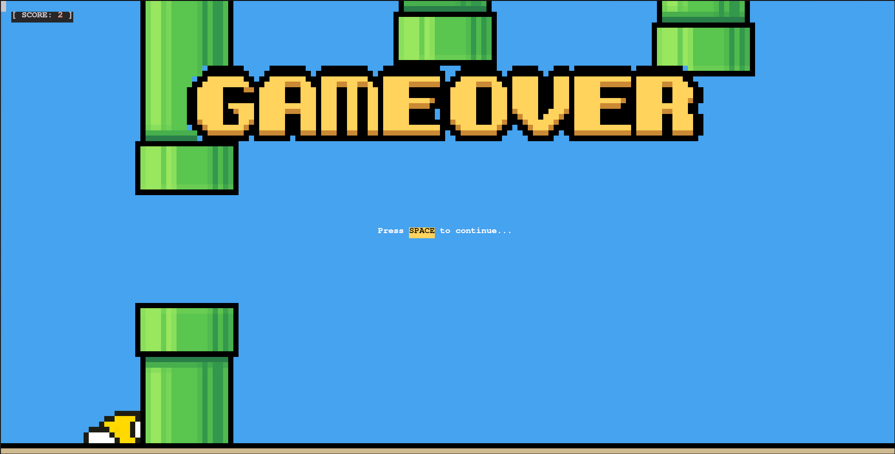

<div align="center">
    
    <h1>tengine - Terminal based Game Engine</h3>
    <p><a href="#features">Features</a> • <a href="#showcase">Showcase</a> • <a href="#getting-started">Getting Startet</a> • <a href="#core-components">Core Components</a> • <a href="#advanced-features">Advanced Features</a> • <a href="#example-games">Example Games</a> • <a href="#roadmap">Roadmap</a> • <a href="#contributing">Contributing</a></p>
</div>

---

<br>

A lightweight, dependency-free engine for creating terminal-based games in Python. Perfect for building text-based adventures, roguelikes, and retro-style games.

```bash
# Quick start
git clone https://github.com/yourusername/tengine.git
cd tengine
python3 snake.py  # Run the example game
```

## Features
- **Cross-platform** - Works on Windows, Linux, and macOS
- **ANSI color support** - Full 16-color support with formatting options
- **Input handling** - Real-time keyboard input without blocking
- **Scene management** - Easy scene transitions and organization
- **Lightweight** - No external dependencies
- **Simple API** - Intuitive object-oriented design

## Showcase
This is an example of what tengine is capable of:
<details>
<summary>Show images 📷</summary>
<div align="left">
    
    
    
    
    
</div>
</details>

> [!NOTE]  
> Still all running in the terminal. Even the flappybird clone. :)

## Getting Started

### Basic Game Structure
```python
from tengine import Game, Scene, Point
from tengine.color import Color

# Create game object
game = Game(
    width=40,
    height=20,
    border=True
)

class MainScene(Scene):
    def __init__(self):
        # Initialize variables and configure your sceen using the super().__init__() function call
        super().__init__(
            tickdelay = 0.1, # Update interval in seconds
            bg_symbol = '.'  # Background character
        )
        self.position: Point

    def setup(self):
        # Scene setup goes here
        self.position = Point(5, 5)
        
    def update(self):
        # Game logic goes here
        self.render_queue.add_point(self.position, "P")

# Initialize and run game
if __name__ == "__main__":
    game.add_scene("main", MainScene()) # Add scene MainScene
    game.set_scene("main") # Set scene to "main"
    game.run() # Run the game
```

## Core Components

### Game Class
The main controller for your game:
```python
game = Game(
    x_size=60,       # Grid width in characters
    y_size=30,       # Grid height in characters
    border=True      # Display border around play area
)
```

### Scene Class
Represents different game states (menus, levels, etc.):
```python
class CustomScene(Scene):
    def __init__(self):
        """Initial scene Initialization"""
        super().__init__(
            tickdelay=0.1,       # Tick update interval in seconds
            bg_symbol=' ',        # Background character
        )
    
    def setup(self):
        """Initialize scene resources (called each time the game switches to this scene using Game.set_scene)"""
        
    def update(self):
        """Called every tick for game logic"""
```

### Rendering System
Add content to the display:
```python
# Add single character at position
Scene.render_queue.add_point(Point(3, 4), "#")

# Add multi-line string of characters starting from origin point
Scene.render_queue.add_string("[----------]", Point(10, 5))

# Format text using Color class
Scene.render_queue.add_string(f"{Color.bold}{Color.fg.Red}[ SCORE: 100 ] {Color.reset}", Point(0, 0))
```
Each Scene instance has its own render queue which can be accessed via: `self.render_queue`. You can also manipulate a scenes render queue from outside the instance like so: `scene.render_queue`.

### Input Handling
Handle keyboard input:
```python
class GameScene(Scene):
    def __init__(self):
        super().__init__()
        # Bind keys to handler function
        self.input_manager.add_binding('a', lambda key: self.key_handler(key))
        self.input_manager.add_binding('b', lambda key: self.key_handler(key))
        self.input_manager.add_binding('c', lambda key: self.key_handler(key))
        
        self.last_key: str # Var to hold last key that was pressed
        
    def key_handler(self, key):
        # Handle key press
        self.last_key = key

    def setup(self):
        # Initialize var when scene is loaded
        self.last_key = "..."

    def update(self):
        # Display last key that was pressed on screen
        self.render_queue.add_string(f"Last Key Pressed: {self.last_key}", Point(1, 1))
        
```

### Color System
Use ANSI colors for rich visuals:
```python
from tengine.color import Color

# Basic usage
f"{Color.fg.red}Warning! {Color.fg.green}Safe zone{Color.reset}"

# Combine styles
f"{Color.bold}{Color.underline}Important!{Color.reset}"

# Background colors
f"{Color.bg.blue}Water area{Color.reset}"
```

## Advanced Features

### ANSI String Handling
```python
from tengine.color import len_no_ansi

text = f"{Color.fg.red}Hello{Color.reset}"
print(len(text)) # Resulting number will be much larger then the text displayed because the ansi codes are also counted as characters.
print(len_no_ansi(text))  # Using len_no_ansi will strip the text of ansi codes before counting the length, which results in the correct number.
```

### Coordinate System
The `Point` class simplifies position math:
```python
p1 = Point(3, 4)
p2 = Point(1, 1)

print(p1 + p2)  # → Point(4, 5)
print(p1 > p2)  # → True
```

## Example Games
### Snake
The repository includes a complete Snake game:
```bash
mv examples/snake/* .
python3 snake.py
```
The game gives a simple usage example for tengine.
This includes:
- The coloring system
- Saving game states
- Input management
- Multiple scenes
- Dynamic object rendering

Take a look at [snake.py](examples/snake/snake.py) to lern more about how the game works.

### Flappybord
The repository also includes a complete Flappybord clone:
```bash
mv examples/flappybird/* .
python3 flappybird.py
```
The game gives a advanced usage example for tengine.
This includes:
- The rgb coloring system
- Saving game states
- Input management
- Multiple scenes
- Dynamic .ppm sprite rendering.
- Collison detection using collider boxes.

Take a look at [flappybird.py](examples/flappybird/flappybird.py) to lern more about how the game works.

## Roadmap
Planned features:
- Terminal resize handling
- More example games (Slots, Flappybird)
- Improved documentation
- Abstraction layer for rendering (Lines, Circles, Boxes, img2asci)
- Entity component system (ECS)

## Contributing
Contributions are welcome! Thx 💜

<a href = "https://github.com/iinsertNameHere/tengine/graphs/contributors">
    
</a>

<br>
<br>

---

<div align="center">
    
</div>
